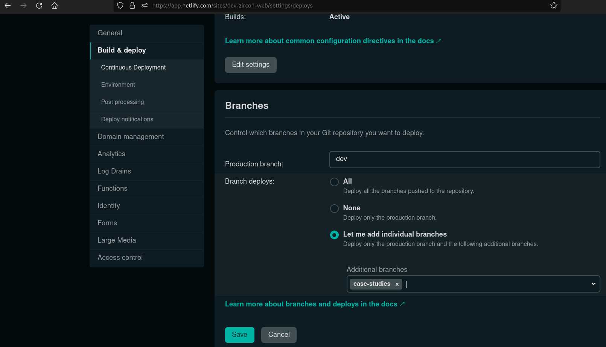

# ZirconTech Web

## Setup

Nota: Antes de ejecutar los siguientes comandos situate en la branch adecuada, o de ser necesario crea una nueva (para como crear branches y commits vease las guidelines indicadas en el Onboarding técnico de ZirconTech).

Para ello puedes ejecutar `git checkout -b feature/some-feature` para crear una nueva branch o `git switch feature/some-feature` para cambiarte a una branch ya existente sobre la cual vayas a trabajar.

### Instalar yarn

`npm i -g yarn`

### Instalar dependencias

`yarn install`

Tener en cuenta que las versiones compatibles de node son las siguientes: "^12.22.0 || ^14.17.0 || >=16.0.0"
Instalar Node Version Manager (nvm) para moverse entre versiones.

### Netlify

#### Instalar CLI de Netlify

`npm i -g netlify-cli`

#### Configurar CLI de Netlify

Logearse con el siguiente comando, el mismo abrirá la página de Netlify y hay que autorizar su uso: 

`netlify login`

Luego de haberse logeado, correr el comando:

`netlify link`

Seleccionar las opciones:

1. `Choose from a list of recently updated sites`

2. `dev-zircon-web` o `zircon-tech` dependiendo de en donde se quiera trabajar, si se quiere trabajar para la web en desarrollo, seleccionar `dev-zircon-web`, si se quiere trabajar sobre la que está en producción, seleccionar `zircon-tech`

3. Es probable que el comando anterior pida autorizar el uso desde la CLI (se abrirá el navegador y hay que darle permisos)

#### Configurar Sitios de Netlify

Actualmente contamos con dos páginas, una de producción y otra de desarrollo, estas se pueden ver en [Sites](https://app.netlify.com/teams/andres-qhxitxg/sites), `dev-zircon-web` es la de desarrollo y `zircon.tech` es la de producción. Clickear en cualquiera de ellas habilita la opción `Site Settings`, ir a la sección "Build and Deploy", y configurar lo que sea necesario, a continuación se explica como hacerlo para los deploys automáticos

#### Configurar los deploys automáticos

Los deploys automáticos se efectúan al hacer `git push` en un determinado set de branches, estas se indican en la configuración de netlify como se ve en la siguiente imagen: 

## Correr web

### En desarrollo

Con netlify (recomendado, así comprobamos que todo vaya a funcionar con un deploy más tarde): `netlify dev`

Con next: `yarn dev`

Estando en la branch dev, también se puede usar el comando `netlify deploy`, el mismo hará deploy en modo preview a una URL dedicada específicamente a los cambios que se hayan realizado (verificar que efectivamente estamos en la branch `dev` y que que el site al que hacemos deploy es a `dev-zircon-web`)

## Flujo sugerido

1. `netlify link`

2. `netlify dev`

3. `netlify build`

4. `netlify deploy` (hace un deploy en modo preview)

5. `git push` (hace el deploy a zircon.tech o dev-zircon-web según lo que se haya elegido en el paso 1)
## Notas

- Es una buena práctica que siempre chequeemos de antemano haciendo una build local, para no hacer un deploy que va a terminar fallando. Para eso correr el comando `netlify build`, si este no tiene errores, hacer el deploy o push tranquilamente

- Puede ser que las builds se muestren rotas al hacerse el deploy (al ver la página hay cosas que no cargan), esto se debe al cache de la build anterior. Para solucionarlo, en la página de Netlify ir a la sección `Deploys` y clickear `Trigger Deploy` -> `Clear cache and deploy site`

- Si queremos enviar los cambios de las ramas de desarrollo a la `main`, crear una Pull Request y asginar a @wolivera para su revisión. Al igual que con los commits, hacer un push a main genera un deploy automático a `zircon.tech`.

- En caso de que una build publicada esté rota en la página de producción, ir a `Deploys` -> seleccionar el deploy anterior que si estaba funcionando -> `Publish Deploy`. Usualmente esto debería ser solucionado con lo comentado en la nota anterior, de no ser así solicitar ayuda para encontrar qué puede estar causando el problema.

## Recursos

Documentación de la [CLI de Netlify](https://docs.netlify.com/cli/get-started/)